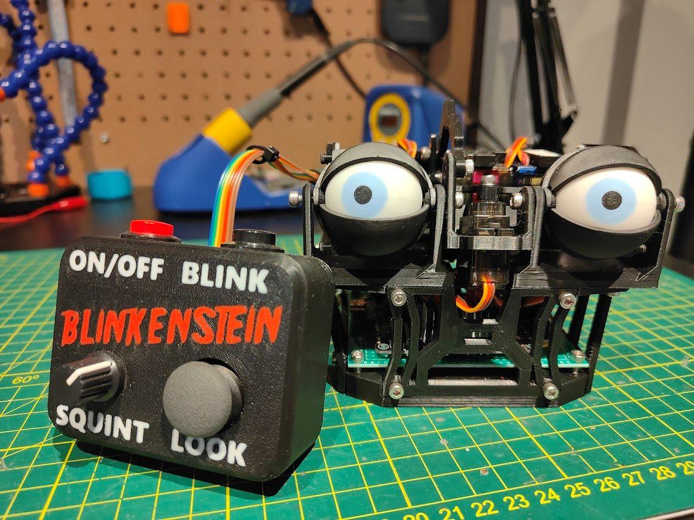

# Blinkenstein

Yet another arduino control codebase for the [Simplified 3D Printed Animatronic Dual Eye Mechanism](https://www.instructables.com/Simplified-3D-Printed-Animatronic-Dual-Eye-Mechani)

## Capabilities & Features
Manual Control
  - Pan (Joystick X Axis )
  - Tilt (Joystick Y Axis)
  - Eyelid Control / Squint (Potentiometer)
  - Blink (Button / Joystick Press Button)
  - Soft Power (For when charging circuit is activated)
Automated Control
  - Take over after manual control timeout (MANUAL_CONTROL_TIMEOUT)
  - Auto Power off after timeout (AUTO_POWER_OFF_TIMEOUT)
  - Sleep before Auto Power Off
  - Randomised behaviour
    - 5x eyelid squint positions
    - 5x eye tilt positions
    - 7x eye pan positions
    - Blink / Blink & Look direction change
General
  - Random eye position jitter to emulate realistic eye movement
  - Automatic eyelid adjustment to ensure pupil visibility when tilting above or below eyelid position

## Development notes
My intention was to generate much of this code with Github Co-Pilot in an attempt to better understand
how LLMs integrate into IDEs and where the line between help and hinderance is.

## Hardware
- M5Stamp C3
- PCA9685 16 Channel Servo Control Board
- Adafruit (clone) 2-axis Thumb Joystick with Select Button + Breakout Board
- CKCS/Ouwei Type-C USB 5v 2A Step-Up Boost Converter Power Module LIPO Charging board
- 2400maH LIPO 1S battery
- Various resistors, capacitors, buttons, potentiometers etc... all outlined in the circuit diagram

## Debugging
To enable or disable debugging, comment or un-comment the `#define SERIAL_DEBUG` line in [config.h](src/config.h#L10)
General messages are logged automatically. To continuously output the state of the StateManager, InputHandler or ServoController, set the define values for `DEBUG_STATE`, `DEBUG_INPUT` and `DEBUG_SERVOS` respectively.

## TODO
- Add the circuit diagram to the codebase and the `README.md`
- Add photos to the `README.md`